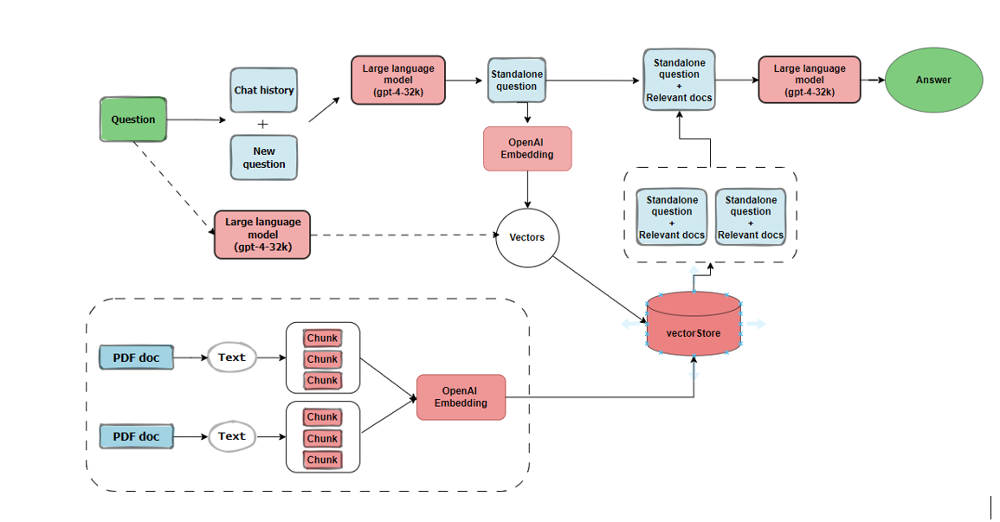
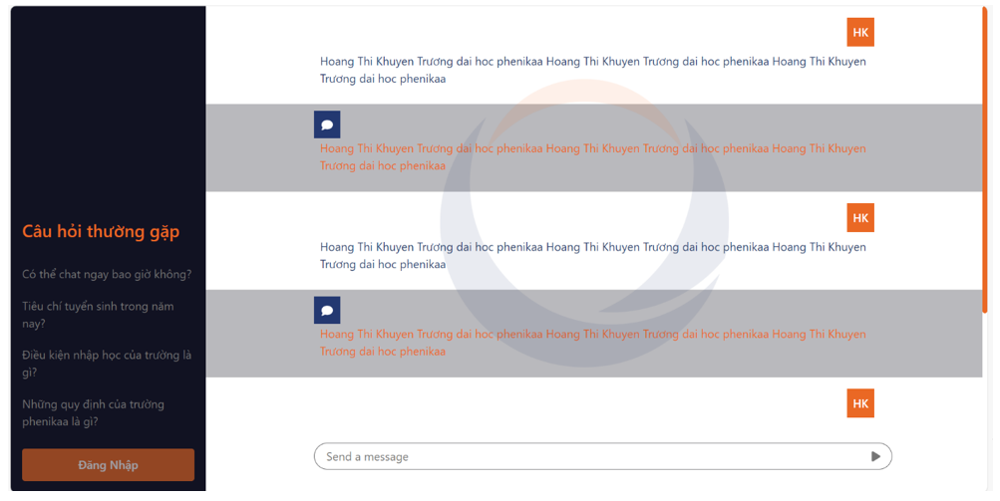

# ChatPDF_Phenikaa
## Mô tả: 
ChatPDF_Phenikaa là ứng dụng cho phép người dùng có thể tra cứu thông tin, tương tác với chatbot tự động.   

Mục tiêu của dự án là tạo ra một hệ thống chatbot linh hoạt và thông minh, nhằm cung cấp dịch vụ hỗ trợ và thông tin đa dạng, từ thông tin về chương trình học tập đến các thông báo sự kiện và tư vấn về dịch vụ sinh viên.    
  
Chúng tôi cũng cung cấp giao diện trực quan, giúp người dùng có thể dễ dàng thao tác với ứng dụng.
## Kiến trúc hệ thống



## Giao diện chat




## Chạy chương trình
1. Tạo file .env vào thư mục gốc
2. Thêm API key vào biến: OPENAI_API_KEY = "Your key"
3. install
```shell
pip install -r requirements.txt
```
4. run
```shell
python run.py
```

## Tính năng

- [x] Chat with GPT-3.5
- [x] Chat with file by langchain, flask, SQLite db .


